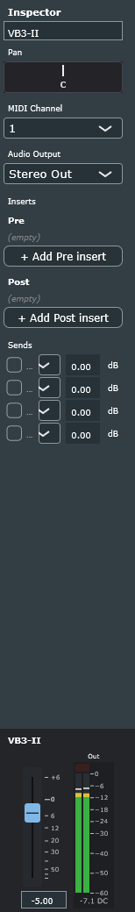
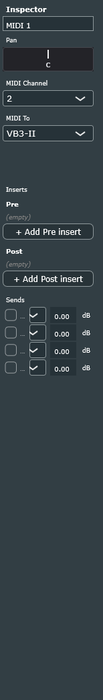
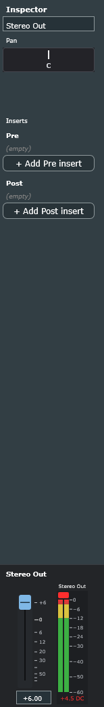

# Organ residual signal / click isolation + Inspector meter correction (1.1.9)

| | |
|---|---|
| Date | 2026-10-03 |
| Follows | `EXPORT_LEVELS_INSPECTOR_METERS_2026-10-01.md` (1.1.8) |
| Build with the changes | `build\ninja-debug\MiniDAWLab_artefacts\Debug\MiniDAWLab.exe` (Debug), `build\ninja-release\MiniDAWLab_artefacts\Release\MiniDAWLab.exe` + installer / zip 1.1.9 (Release) |
| Project material | sibling copy `%TEMP%\dal-tse-copy\TSE_pt2.dalproj` (+ media). The user's real project and the running DAL process were not touched. |
| Evidence | `docs/evidence/organ-dc-2026-10-03/` (isolation log, in-app run log, `.vstpreset`), `docs/evidence/inspector-single-meter-2026-10-03/` (PNGs) |

## Scope

1. Inspector channel panel: show **only the selected row's audio output** (remove the always-visible
   Stereo Out meter from 1.1.8; this explicitly replaces the earlier "constant master display"
   instruction).
2. Isolate the VB3-II organ's residual signal (~−12 dBFS on the meter with nothing playing) and the
   click on mute / unmute with the transport stopped. Confirm in current samples, separate DC from
   AC, reproduce with fresh plug-in instances, isolate one parameter at a time, fix an established
   DAL fault at the source — no global DC filter, auto-EQ, normalisation or a bare mute ramp.

## Part 1 — Inspector panel shows the selected row's output only

| Selected row | Panel |
|---|---|
| Audio / Instrument / Group | the row's **Channel Volume fader** + **one meter: the row's post-strip output** ("Out") |
| Stereo Out | the **master fader** + **one meter: Stereo Out** ("Stereo Out", fed from the master accumulator) |
| MIDI row, or no selected row | **panel hidden** — the scroll area takes the whole Inspector column |

- `ChannelStripPanel` now has a single `LevelMeterComponent` (`outputMeter()`), a caption, and
  `hasAudioStrip()`; `InspectorPanel::resized()` hides the panel (0 px) and gives the viewport the
  full column when the strip is not shown; `onAudioStripVisibilityChanged` re-lays out on row switch.
- The engine tap (`setMeteredTrackForUi`) is re-pointed on every row change (master and MIDI rows
  release it). The master accumulator keeps folding on every callback regardless of what is shown,
  so the export level report and the `--stability-*` diagnostics (`drainMasterOutputLevelsForDiagnostics`)
  are unaffected by the hidden master meter.
- `LevelMeterComponent`: the "DC" tag is dropped when no block has been folded for 0.5 s (it used to
  stick while the row was muted, describing a signal that no longer existed).
- Scrolling, the fixed bottom position, the fader (typed values, Ctrl/Cmd+click reset, −∞ … +6 dB)
  and the overload latch are unchanged.

Verified in the running app by `--stability-inspector-panel` (PASS, 10 PNGs):

| Row | Observed |
|---|---|
| audio "Track 1" | fader shown, outputMeter shown (track tap = 1), fader text "0.00" |
| instrument "Track 3" / "VB3-II" | fader shown, outputMeter shown (track tap = 3 / 5), −3.00 / −5.00 |
| MIDI "MIDI 1" | fader hidden, outputMeter hidden, no tap, panel height 0, viewport = full column |
| Stereo Out | fader shown, outputMeter shown (**Stereo Out**, no track tap), −5.00; after +6 dB playback: held peak +4.5, OVERLOAD latched, DC tag |
| low window (366 px) | content 566 px scrolls, scrollbar shown, panel pinned |

## Part 2 — The organ's residual signal and click

### 2.1 Confirmed in current samples (running app, transport stopped)

`--stability-organ-dc <project copy>` selects the VB3-II row exactly like a header click and reads
the row's **diagnostics accumulator** (every block the strip folds, drained-and-reset per window —
not the UI meter's peak hold) in 2 s windows. DC = mean of the samples in the window, AC RMS = RMS of
the samples after removing that mean.

| Window (transport stopped) | Organ post-strip | Stereo Out |
|---|---|---|
| before any playback | dc 0.0000, acRms 0.00000, peak 0.0000 | 0 |
| muted | 0 | 0 |
| unmuted again | 0 | 0 |
| **after 4 s playback (24–28 s) + stop** | **dc +0.3404 (−9.36 dBFS), acRms 0.00028, peak 0.3439** | **dc +0.1914 (−14.36 dBFS), acRms 0.0038** |
| muted after playback | 0 | dc 0.0000, peak 0.0010 |

So the residual is **real, in the current samples, and is almost pure DC** (AC component −71 dBFS).
The UI meter shows it as −10.2 dB with the DC tag — not a stale hold. Mute removes it entirely
(Stereo Out drops from +0.19 to 0 in one block = **a 0.19 step = the click**); unmute puts the step
back. The master strip at −5 dB turns the organ's +0.34 into +0.19 at Stereo Out.

### 2.2 Fresh-instance reproduction and one-parameter isolation (outside the app)

`ExportLevelFocusedTests --probe-vst3-isolate "C:\Program Files\Common Files\VST3\VB3-II.vst3"
<project copy> 5 <outDir>` hosts VB3-II 2.3.1 in a plain JUCE `AudioProcessor` harness (no DAL
engine, no strip). Each line is a **fresh instance** (reset did not clear state in 1.1.8's probe).
Protocol per instance: 1 s silence → 2 s chord (C3 E3 G3 C4) → note-off → 3 s → 3 s; measured DC
before, during, after and late. Full log: `evidence/organ-dc-2026-10-03/vb3ii-dc-isolation-fresh-instances.txt`.

| Case | dcBefore | dcAfter note-off | acRmsAfter | dcLate |
|---|---|---|---|---|
| A saved state (user's preset), note-offs + all-notes-off | 0.0000 | **+0.5959 (−4.50 dBFS)** | 0.047 | 0.6054 |
| A2 saved state, note-offs only | 0.0000 | +0.5959 | 0.047 | 0.6054 |
| A3 saved state, all-sound-off | 0.0000 | +0.2598 | 0.104 | 0.2568 |
| B plug-in defaults | 0.0000 | 0.0000 | 0.005 | 0.0000 |
| C defaults + the saved **values** set through the parameter API | 0.0000 | −0.5885 | 0.093 | −0.6054 |

C proves the DC follows the **parameter values**, not JUCE's state-restore mechanism or DAL's
state chunk. D — saved state with exactly one of the 41 differing parameters reverted to default,
fresh instance each:

| Reverted parameter | dcAfter | Effect |
|---|---|---|
| **"Overdrive" 1.000 → 0.393** | **0.003** | DC gone |
| **"Rotary FX Tube Feedback" 0.614 → 0.000** | **0.003** | DC gone |
| "Amp Selection" 2 → 0 | 0.070 | mostly gone |
| "Rotary FX Ambience" 0.380 → 0.254 | 0.47 | slightly less |
| "Rotary FX Balance" 0.490 → 0.559 | 0.53 | slightly less |
| "Volume" 0.504 → 0.780 | 0.90 | more (it is just gain) |
| every other parameter (drawbars, tabs, reverb, EQ, percussion, vibrato, swell, generator …) | ≈ ±0.60 | no change (sign flips are the rotary phase) |

E — sweeps of the suspects, fresh instance per value:

| Parameter | 0 | 0.25 | 0.5 | 0.75 | 1.0 |
|---|---|---|---|---|---|
| Rotary FX Tube Feedback | 0.003 | 0.003 | −0.50 | +0.64 | +0.66 |
| Amp Selection (0,1,2,3) | 0.07 | 0.43 | 0.60 (saved) | 0.17 | — |
| Use VB3 v.1.4 organ engine (0 / 1) | 0.60 | 0.59 | | | |
| Preamp Bass / Treble, Delay Feedback, Spring Reverb Damp, Horn/Bass Ramp, Digital Reverb Damp | ≈ 0.60 at every value |

**Result:** the DC is produced by VB3-II's rotary-cabinet **Tube Feedback** stage (threshold between
0.25 and 0.5) driving the **Overdrive** at maximum into amp model 2 — the saved preset's combination.
It starts the moment the first note sounds (dcDuring +0.25), rises when the notes stop and never
decays (the plug-in idles at its new operating point). Both organ-engine versions (v.1.4 / v.2)
show it, so the "V.1b / V.2" choice is not the cause. This is the plug-in's DSP behaviour, outside
DAL.

### 2.3 Cubase comparison (not performed — material delivered)

A comparison in a non-JUCE host could not be automated from here. Reproduction package in
`evidence/organ-dc-2026-10-03/`:

- `VB3-II-track5.vstpreset` — the user's saved organ state written as a standard VST3 preset
  (class ID `ABCDEF019182FAEB4753693056423332`, component chunk 7853 bytes). The original project
  state is untouched.
- Steps: load VB3-II on an instrument track in Cubase, load the preset, play a C3–E3–G3–C4 chord
  for 2 s, release, stop. Expected per the isolation: the channel meter does not return to −∞ but
  rests around −4.5 dBFS with a DC indication (Cubase's SuperVision "DC offset" module or an
  export's statistics show ≈ +0.6 mean). Then set Rotary FX Tube Feedback to 0 (or Overdrive to its
  default) in a new instance and repeat: the meter returns to silence.

Limitation: two JUCE hosts (DAL, the probe harness) are not independent evidence that the hosting
is correct; the preset package exists so the user can obtain that evidence in Cubase.

### 2.4 Established DAL fault, fixed at the source: muted instrument rows were skipped, not silenced

The engine's instrument mix loops (realtime `audioDeviceIOCallbackWithContext` and offline
`renderOfflineMixdownBlock`) and `renderInstrumentPostStripToStereoScratch` **skipped a muted
instrument row (and one with the fader at −∞) before the host processed the block**. Consequences:

- `TrackKind::Midi` sources routed to the muted instrument keep scheduling their events into the
  destination host's per-block buffer every block (`PlaybackEngine` routes by the source's state, not
  the destination's mute) — the buffer was never consumed, so it **grew on the audio thread for the
  whole mute** and was delivered as **one stale burst on unmute**.
- The note-offs the organ's own controller flushes at mute (so mute never strands sounding notes)
  were queued but never processed: the plug-in kept its notes **frozen** until unmute.
- The plug-in's internal state (tails, reverb, the DC operating point) stayed exactly where it was;
  unmute resumed it mid-state.
- The muted row produced no post-strip blocks at all (`frames=0` in the first organ-dc run), so
  nothing downstream — meters, sends, group buses — ran for it.

Fix (`PlaybackEngine.cpp` ×2, `PlaybackMixHelpers.cpp`): mute and a fader at −∞ are **gain
decisions after the host ran**: `fader = isMuted ? 0 : channelFaderGain`, the host processes every
block (MIDI consumed, state follows the transport), the strip folds the output with gain 0. Only
**Off** skips the host — as `CURRENT_ARCHITECTURE.md` ("Power (Off) vs Mute") always specified.

Verified in the running app (`--stability-organ-dc`, PASS; log in `evidence/organ-dc-2026-10-03/organ-dc-in-app-run-after-fix.txt`):

| Measurement | Result |
|---|---|
| host blocks processed in a 2 s window, transport stopped, unmuted / muted | 766 / 765 (identical rate) |
| organ stage frames while muted | 98 048 per window (was 0) with dc 0, peak 0 |
| reference 5 s unmuted playback from 24 s: max MIDI events delivered in one block | 5 |
| 4 000 ms muted playback: host blocks while muted / max events in one block while muted / max in the 1 s after unmute | 1 519 / 17 / 2 |
| 300 ms muted playback: same | 118 / 17 / 2 |

The 17-event block occurs at the **start** of the muted run for both durations: it is the designed
flush of the sounding notes' note-offs at the mute discontinuity (bounded by the number of held
notes), not accumulation — accumulation would scale with the mute duration (4 s ≈ 1 500 blocks
of routed MIDI), and the unmute block carries 2 events in both runs.

### 2.5 What is solved and what is not

| Problem | Status |
|---|---|
| Residual meter level on the organ row with nothing playing | **Diagnosed, not a DAL fault**: a constant DC offset (+0.34 at the row, +0.19 at Stereo Out) produced by the VB3-II preset (Tube Feedback ≥ 0.5 + Overdrive 1.0 + amp 2) after the first note. DAL shows it (meter + DC tag), does not hide it. |
| Click when muting / unmuting the organ with the transport stopped | **Diagnosed, not a DAL fault**: the mute switches the DC step. It persists as long as the preset carries DC. Changing Tube Feedback to ≤ 0.25 or Overdrive to its default in the user's preset (verified in isolation) removes the DC and therefore the click. No mute ramp, DC filter or fade was added (would mask the cause). |
| Clicks at export edges (1.1.8 finding) | Same cause; same remedy. |
| Muted instrument rows skipped before the host ran (MIDI accumulation / burst on unmute, frozen plug-in state, no post-strip blocks while muted) | **Fixed at the source** in realtime, offline and the shared helper; verified in-app. |
| Stale "DC" tag on a muted row's meter | **Fixed** (tag drops after 0.5 s without blocks). |
| Inspector panel showing an extra always-visible Stereo Out meter | **Fixed** (selected row's output only; hidden for MIDI / none). |

## Regression

| Check | Result |
|---|---|
| `ExportLevelFocusedTests` | 47 checks, 0 failures |
| `InputRoutingFocusedTests` | 56 / 0 |
| `MixdownPreGainFocusedTests --no-ui` | 49 / 0 |
| `InsertPersistenceFocusedTests` | 121 / 0 |
| `TrackHeaderColumnFocusedTests` | 103 / 0 |
| `MiniDAWSelftests` | 3220 / 0 |
| `--stability-organ-dc` (TSE copy) | PASS |
| `--stability-inspector-panel` (TSE copy) | PASS |
| `--stability-export-levels` (TSE copy) | PASS (realtime vs float / 24-bit / MP3 unchanged) |
| `--stability-mixdown --format wav` / `mp3` (pregain fixture) | PASS / PASS |
| `--stability-pregain` (fixture) | PASS |
| `--stability-header-column` (TSE copy) | PASS |

Exit code −1073741819 after `RESULT: PASS` on the TSE copy is the known AmpliTube 4 teardown crash
(`0x7675E`), unchanged.

## Files

- `src/ui/ChannelStripPanel.h/.cpp`, `src/ui/InspectorPanel.h/.cpp`, `src/ui/LevelMeterComponent.h/.cpp`
- `src/engine/PlaybackEngine.cpp`, `src/engine/PlaybackMixHelpers.cpp`
- `src/plugins/ExperimentalInstrumentHost.h/.cpp` (diagnostic: max MIDI events per delivered block)
- `src/diagnostics/StabilityScenarioRunner.h/.cpp` (`--stability-organ-dc`, inspector-panel scenario updated), `src/app/MainAppWindow.cpp` (hooks)
- `tests/selftest/ExportLevelFocusedTestsMain.cpp` (`--probe-vst3-isolate`, `.vstpreset` writer)
- `docs/CURRENT_ARCHITECTURE.md`, `docs/DEVELOPMENT_TEST_POLICY.md`, `docs/releases/1.1.9.md`, evidence folders
